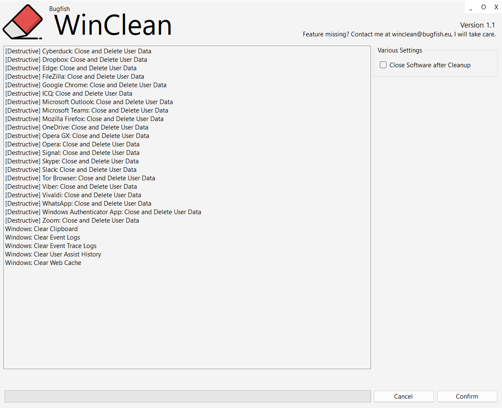

# Bugfish WinClean 

## 🔍 Introduction

Bugfish WinClean is a lightweight Windows optimization tool that safely cleans system clutter, removes unnecessary files, and clears privacy traces to help your PC run faster, smoother, and more securely.

## ✨ Features

> The desctructive functionalitites will use all user data of the specific software, be cautios this will delete everything you set up in the software like bookmarks, password, keys and more.

### 1. System Restore Cleanup
**Deletes old system restore points** to free up disk space, keeping only the most recent backups for emergencies.

### 2. DirectX Shader Cache Cleanup
**Removes cached DirectX shader files** that can build up over time, resolving graphics glitches and freeing storage.

### 3. Windows Update Cleanup
**Deletes outdated Windows Update files and logs** that are no longer needed after updates, reclaiming significant disk space.

### 4. Recent Documents History Cleanup
**Clears the list of recently opened documents and jump lists,** protecting your privacy and decluttering the system.

### 5. Driver Installation Log Cleanup
**Removes log files created during driver installations,** which are only needed for troubleshooting and can safely be deleted.

### 6. WebCache Cleanup
**Deletes the Windows WebCache database,** which stores web-related data for apps like Edge and File Explorer, improving privacy and performance.

### 7. UserAssist History Cleanup
**Wipes UserAssist registry entries,** which track programs you've run, enhancing privacy by removing usage traces.

### 8. WebDAV Cache Cleanup
**Removes cached data for WebDAV network drives,** freeing up space and resolving sync issues.

### 9. Memory Dump File Cleanup
**Deletes system memory dump files** created after crashes, which are large and only needed for advanced troubleshooting.

### 10. Windows Error Reporting Cleanup
**Removes error report files** sent to Microsoft after crashes, which can accumulate and use disk space.

### 11. Windows Log File Cleanup
**Deletes various Windows and setup log files** that are only useful for diagnostics and can be safely removed.

### 12. Event Trace Log Cleanup
**Removes event trace log files** used for system diagnostics, which are unnecessary for most users.

### 13. Font Cache Cleanup
**Clears font cache files** to fix font display issues and free up space.

### 14. Recent Files List Cleanup
**Deletes shortcuts in the Recent Files folder,** removing traces of recently accessed documents.
### 15. Prefetch Folder Cleanup
**Clears the Windows Prefetch folder,** which can become cluttered over time and slow down boot or app launches.

### 16. DNS Cache Flush
**Flushes the DNS resolver cache,** resolving network issues and ensuring up-to-date website address resolution.

## 🖱️ Usage Information

- Copy the prefered version folder from _releases/_executable/VERSION to your computer.
- Ensure all files in the source folder remain together-do not move or delete any files.
- Run bugfish-winclean.exe.
- Enable or Disable prefered or not-wanted items.
- When ready, press the start (play) button.

## ❓ Support Channels

If you encounter any issues or have questions while using this software, feel free to contact us:

- **GitHub Issues** is the main platform for reporting bugs, asking questions, or submitting feature requests: [https://github.com/bugfishtm/bugfish-winclean/issues](https://github.com/bugfishtm/bugfish-winclean/issues)
- **Discord Community** is available for live discussions, support, and connecting with other users: [Join us on Discord](https://discord.com/invite/nqe2HSuKee)  
- **Email support** is recommended only for urgent security-related issues: [security@bugfish.eu](mailto:security@bugfish.eu)
- **Tutorial Video** for a full walkthrough, at https://www.youtube.com/playlist?list=PL6npOHuBGrpDlS6CCHIUDz5O9mOnH7-7E.

## 📢 Spread the Word

Help us grow by sharing this project with others! You can:  

* **Tweet about it** – Share your thoughts on [Twitter/X](https://twitter.com) and link us!  
* **Post on LinkedIn** – Let your professional network know about this project on [LinkedIn](https://www.linkedin.com).  
* **Share on Reddit** – Talk about it in relevant subreddits like [r/programming](https://www.reddit.com/r/programming/) or [r/opensource](https://www.reddit.com/r/opensource/).  
* **Tell Your Community** – Spread the word in Discord servers, Slack groups, and forums.  

## 📁 Repository Structure 

This table provides an overview of key files and folders related to the repository. Click on the links to access each file for more detailed information. If certain folders are missing from the repository, they are irrelevant to this project.

|Document Type|Description|
|----|-----|
| .github | Folder with github setup files. |
| [.github/CODE_OF_CONDUCT.md](./.github/CODE_OF_CONDUCT.md) | The community guidelines. |
| _changelogs | Folder for changelogs. |
| _images | Folder for project images. |
| _packages | Folder for installable packages mostly for suitefish-cms. |
| _releases | Folder for releases. |
| _screenshots | Folder with project screenshots. |
| _source | Folder with the source code. |
| _videos | Folder with videos related to the project. |
| .gitattributes | Repository setting file. Only for development purposes. |
| .gitignore | Repository ignore file. Only for development purposes. |
| docs | Folder for Github Pages Documentation. |
| README.md | Readme of this project. You are currently looking at this file. |
| repository_reset.bat | File to reset this repository. Only for development purposes. |
| repository_update.bat | File to update this repository. Only for development purposes. |
| [CONTRIBUTING.md](CONTRIBUTING.md) | Information for contributors. | 
| [CHANGELOG.md](CHANGELOG.md) | Information about changelogs. | 
| [SECURITY.md](SECURITY.md) | How to handle security issues. |
| [LICENSE.md](LICENSE.md) | License of this project. |

## 📑 Changelog Information

Refer to the `_changelogs` folder for detailed insights into the changes made across different versions. The changelogs are available in **HTML format** within this folder, providing a structured record of updates, modifications, and improvements over time. Additionally, **GitHub Releases** follow the same structure and also include these changelogs for easy reference.

## 🌱 Contributing to the Project

I am excited that you're considering contributing to our project! Here are some guidelines to help you get started.

**How to Contribute**

1. Fork the repository to create your own copy.
2. Create a new branch for your work (e.g., `feature/my-feature`).
3. Make your changes and ensure they work as expected.
4. Run tests to confirm everything is functioning correctly.
5. Commit your changes with a clear, concise message.
6. Push your branch to your forked repository.
7. Submit a pull request with a detailed description of your changes.
8. Reference any related issues or discussions in your pull request.

**Coding Style**

- Keep your code clean and well-organized.
- Add comments to explain complex logic or functions.
- Use meaningful and consistent variable and function names.
- Break down code into smaller, reusable functions and components.
- Follow proper indentation and formatting practices.
- Avoid code duplication by reusing existing functions or modules.
- Ensure your code is easily readable and maintainable by others.

## 🤝 Community Guidelines

We’re on a mission to create groundbreaking solutions, pushing the boundaries of technology. By being here, you’re an integral part of that journey. 

**Positive Guidelines:**
- Be kind, empathetic, and respectful in all interactions.
- Engage thoughtfully, offering constructive, solution-oriented feedback.
- Foster an environment of collaboration, support, and mutual respect.

**Unacceptable Behavior:**
- Harassment, hate speech, or offensive language.
- Personal attacks, discrimination, or any form of bullying.
- Sharing private or sensitive information without explicit consent.

Let’s collaborate, inspire one another, and build something extraordinary together!

## 🛡️ Warranty and Security

I take security seriously and appreciate responsible disclosure. If you discover a vulnerability, please follow these steps:

- **Do not** report it via public GitHub issues or discussions. Instead, please contact the [security@bugfish.eu](mailto:security@bugfish.eu) email address directly.   
- Provide as much detail as possible, including a description of the issue, steps to reproduce it, and its potential impact.  

I aim to acknowledge reports within **2–4 weeks** and will update you on our progress once the issue is verified and addressed.

This software is provided as-is, without any guarantees of security, reliability, or fitness for any particular purpose. We do not take responsibility for any damage, data loss, security breaches, or other issues that may arise from using this software. By using this software, you agree that We are not liable for any direct, indirect, incidental, or consequential damages. Use it at your own risk.

## 📜 License Information

The license for this software can be found in the [LICENSE.md](LICENSE.md) file. Third-party licenses are located in the ./_licenses folder. The software may also include additional licensed software or libraries.

🐟 Bugfish 
