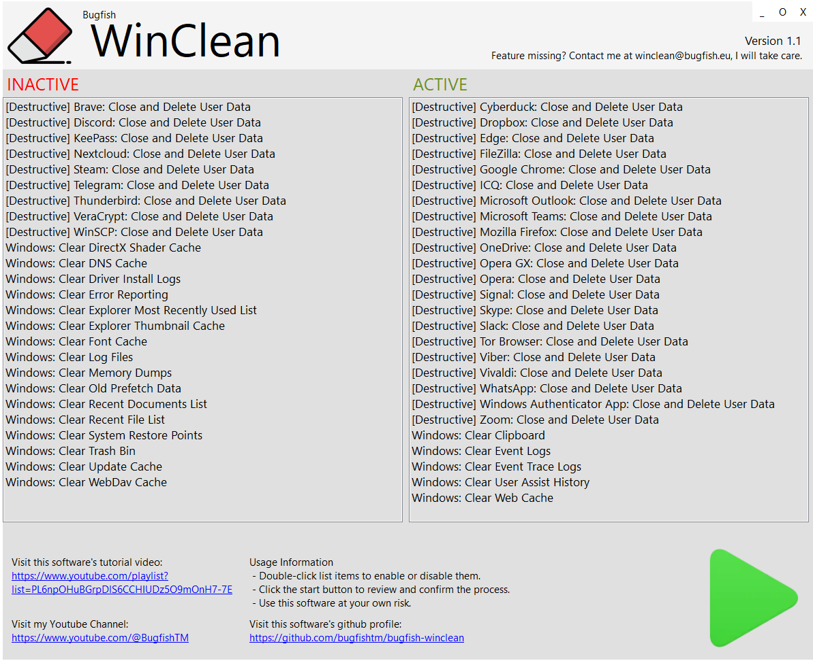

# Bugfish WinClean

Bugfish WinClean: Keep Windows Fast and Fresh

-----------

## Introduction

Bugfish WinClean is a lightweight Windows optimization tool that safely cleans system clutter, removes unnecessary files, and clears privacy traces to help your PC run faster, smoother, and more securely.

## Features

- Instantly erase user data, application traces, and sensitive files in a single - System Restore Cleanup  
- DirectX Shader Cache Cleanup  
- Windows Update Cleanup  
- Recent Documents History Cleanup  
- Driver Installation Log Cleanup  
- WebCache Cleanup  
- UserAssist History Cleanup  
- WebDAV Cache Cleanup  
- Memory Dump File Cleanup  
- Windows Error Reporting Cleanup  
- Windows Log File Cleanup  
- Event Trace Log Cleanup  
- Font Cache Cleanup  
- Recent Files List Cleanup  
- Prefetch Folder Cleanup  
- DNS Cache Flush

-----------

## Screenshots  
Check out our [Screenshots Gallery](./screenshots.html) for a visual overview of the project. You’ll find images showcasing key features and user interface design, offering a preview of what to expect.

-----------

## Tutorials  
Visit the [Tutorials Page](./tutorials.html) for a collection of step-by-step guides that will help you get the most out of the project. These tutorials cover everything from installation to advanced functionality.

-----------

## Downloads  
The [Downloads Section](./download.html) provides all the necessary files to get started with the project, including the latest software versions and any related resources.

-----------

## Installation  
Follow the clear and detailed instructions in our [Installation Guide](./installation.html) to set up the project. This guide will help you get everything running smoothly on your system.

-----------

## Contributing  
Find out how you can contribute to the project by visiting the [Contributing Page](./contributing.html). Whether you want to report bugs, suggest features, or submit improvements, we welcome your involvement.

-----------

## Warranty  
Review the terms of our warranty on the [Warranty Information Page](./warranty.html). This page outlines the scope of support and any applicable guarantees.

-----------

## Support  
If you need assistance, visit the [Support Page](./support.html) to find the available channels for getting help with any issues or questions you might have.

-----------

## License  
Get the full details on licensing by checking out the [License Information Page](./license.html). This section includes the terms and conditions under which the project is distributed.